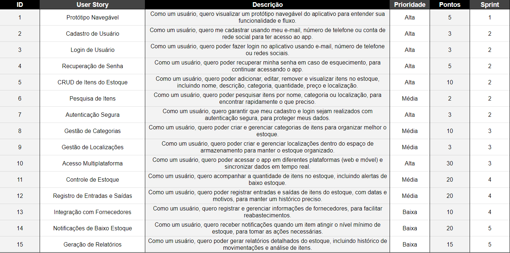

<h1 align='center'>
 ✨ Sprint 2 ✨
    
</h1>

## :mag_right: Índice

    <a href="#objetivo">Objetivo</a> | 
    <a href="#relatorios">Entrega da sprint</a> |
    <a href="#links">Links</a> |
    <a href="#arquivos">Arquivos</a> |
    <a href="#tecnologias">Tecnologias</a> | 

## :dart: Objetivo

    O objetivo da primeira sprint foi o planejamento do projeto, composto por: protótipo navegável, modelagem do banco de dados e backlog.

## :pushpin: Entrega da sprint
Na tabela abaixo é possível visualizar os resultados de cada Sprint clicando em "Ver entrega". 
| Tarefa |            Status           |
|:------:|:---------------------------:|
| Protótipo navegável - mobile | Finalizada |
| Protótipo navegável - desktop | Finalizada |
| Backlog | Finalizada |
| Modelagem do banco de dados | Finalizada |
| Criação de identidade visual | Finalizada |

→ [Voltar ao topo](#topo)

## :clipboard: Links

- [Identidade visual do sistema](https://www.canva.com/design/DAGQLaw8SRk/uztkB7j3hwgoJaWhsLE-Kg/edit?utm_content=DAGQLaw8SRk&utm_campaign=designshare&utm_medium=link2&utm_source=sharebutton)

- [Protótipo navegável - mobile](https://www.figma.com/design/SnbxUN4eQ1Qf2s82KWmrE4/ArtistSupply---mobile?node-id=0-1&t=HauDy0Fvdf7AxRMJ-1)

- [Protótipo navegável - desktop](https://www.figma.com/design/CTlYHK57PkvQcyFOIbMfoP/ArtistSupply---desktop?node-id=0-1&t=HauDy0Fvdf7AxRMJ-1)

→ [Voltar ao topo](#topo)

## :clipboard: Arquivos

→ [Voltar ao topo](#topo)

## 💻 Tecnologias
Foram usadas as seguintes ferramentas, linguagens e tecnologias para a execução do projeto:
- [Figma](https://www.figma.com): Prototipagem
- [Git](https://git-scm.com): Versionamento
- [GitHub](https://github.com/): Armazenamento de código e documentação
- [Notion](https://www.notion.so/): Organização de tarefas
- [MySQL](https://www.mysql.com): Banco de dados

→ [Voltar ao topo](#topo)
